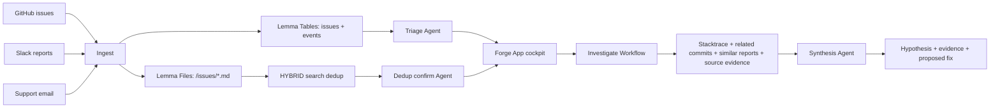

# Forge

> AI Bug Triage & Release Operator built on the Lemma SDK.

Forge turns scattered engineering feedback from GitHub issues, Slack reports, and support email into one prioritized, de-duplicated fix queue. Then it investigates the hard bugs with a Lemma Workflow that cites evidence, grounds the hypothesis in real source, and renders a proposed patch you can inspect.

[Live app](https://forge.apps.lemma.work) | [Product requirements](docs/PRD.md) | [Execution log](docs/EXECUTION.md) | [Decision log](docs/DECISIONS.md) | [Demo script](docs/demo-script.md)


## Submission Writeup

**Problem.** Alex is the founding engineer at a 5-15 person startup. Every morning, bug reports arrive from GitHub, Slack, and support email. The expensive part is not fixing code; it is sorting the pile: reading duplicates, guessing severity, finding reproduction steps, checking whether three complaints are the same crash, and hunting for the source line that probably broke.

**Approach.** Forge makes the next critical bug, and the context to fix it, the first thing Alex sees. It ingests feedback into a Lemma `issues` Table, writes every raw report to Lemma Files for HYBRID search, uses Agents to triage and confirm duplicates, runs an investigation Workflow over deterministic evidence gatherers plus one synthesis agent, and serves the operator cockpit as a Lemma App. The UI exposes the decision path: priority, triage reason, related reports, source citations, proposed diff, human override controls, and an audit trail.

**What we cut and why.** We deliberately skipped infrastructure and secondary product areas that would weaken the core loop. No vector database because Lemma Files already provide chunking, embeddings, and HYBRID search. No Postgres or Redis because Lemma Tables carry the state. No fake confidence percentages because evidence links are more honest. No Release Center in the final build because the strongest product moment is verifiable investigation: the system reads real source and proposes a real diff.

## The Product Moment

Open Forge and the cockpit answers four questions without making the operator sort manually:

| Question | Forge answer |
|---|---|
| What should I fix next? | Critical-first queue with source, repo/channel/mailbox, status, assignee, and related count. |
| Why is it important? | AI triage reason plus reproduction steps, persisted to the issue row. |
| Is this a duplicate? | Lemma Files HYBRID search finds similar reports; a dedup agent confirms; `related_ids` links them. |
| What evidence supports the fix? | Investigation renders source-grounded hypothesis, clickable evidence, and a proposed diff. |

## How It Works




### Lemma Primitive Map

| Lemma primitive | What Forge uses it for |
|---|---|
| **Tables** | `issues` for queue state; `events` for audit timeline. |
| **Files** | One Markdown file per issue, auto-indexed for HYBRID search and RAG. |
| **Agents** | Triage classification, duplicate confirmation, investigation synthesis. |
| **Workflows** | `investigate`: gather evidence, ground source, synthesize result. |
| **Functions** | Validated writes, source evidence fetch, similarity search, override controls. |
| **App** | Single-file operator cockpit deployed to the Lemma pod. |

## Features

### Priority Queue

- Real GitHub issues plus seeded Slack/email reports land in the same queue.
- Critical-first ordering with source, source account, status, assignee, and related report count.
- Source/account switcher groups by GitHub repo, Slack channel, and support mailbox.

### AI Triage With Guardrails

- The triage agent returns strict JSON: `priority`, `repro_steps`, and `reason`.
- `normalize_priority` validates the enum and writes the result. The agent does not directly mutate the table.
- The App shows the reason, not just the verdict.

### Dedup Without a Vector DB

- Each issue body is written to `/issues/{id}.md`.
- `pod.files.search(..., search_method="HYBRID")` retrieves similar reports.
- A read-only `dedup_confirm` agent answers whether they are the same underlying issue.
- `link_related` writes symmetric, idempotent relationships.

### Verifiable Investigation

- The `investigate` workflow gathers stack trace signals, related commits, similar issues, and source evidence.
- `fetch_source_evidence` grounds the suspected symbol in real `cli/cli` source via public GitHub tree/raw content.
- The synthesis agent can only cite provided evidence.
- The App renders the root-cause hypothesis, evidence links, and a unified diff anchored to real lines.

### Human Trust Controls

- Three-dot menu on the opened issue: Priority, Assignee, Status.
- Override writes go through granted Functions: `set_priority`, `set_assignee`, `set_status`.
- Every override appends an `events` row with before/after detail.
- The audit timeline shows `ingested -> triaged -> linked -> operator override`.

## Demo Flow

Use [docs/demo-script.md](docs/demo-script.md) for the 3-minute recording.

1. Show the pain: GitHub, Slack, and email are one messy bug stream.
2. Open Forge: the queue is already ranked.
3. Open `gh_142` or `gh_158`: related reports prove cross-source dedup.
4. Run or show investigation: evidence, hypothesis, source citation, proposed fix.
5. Show Lemma pod resources: Tables, Files, Agents, Functions, Workflow, App.
6. Close on the promise: the next critical bug and fix context are first.

## What We Deliberately Did Not Build

| Cut | Why it was the right cut |
|---|---|
| Vector DB / embeddings pipeline | Lemma Files already chunk, embed, and HYBRID-search issue text. |
| Custom Postgres / Redis / FastAPI | Lemma Tables, Functions, Workflows, and App cover the product backend. |
| Fake confidence score | Evidence links and source citations are more trustworthy than invented percentages. |
| Full Slack/email OAuth | Real connectors add auth and webhook risk; seeded data proves the product loop cleanly. |
| Release Center | The final day went into the stronger hero: verifiable source-grounded investigation. |
| Broad analytics dashboard | Operators need the next fix and evidence trail, not generic charts. |

The product judgment is the point: Forge is intentionally narrow, but the loop is real.

## Repository Layout

```text
app/        Single-file Lemma App cockpit
pod/        Lemma bundle: agents, workflows, functions, tables
ingest/     GitHub, seed, triage, dedup, investigate drivers
seed/       Curated demo issues, Slack reports, email reports
scripts/    Smoke tests, schema helpers, backfills
docs/       PRD, execution log, contracts, decisions, demo script
```

## Runbook

Prerequisites: Python 3.11+, `uv`, Lemma CLI auth.

```powershell
uv venv --python 3.11 .venv
uv pip install -r requirements.txt
uv tool install lemma-terminal
lemma auth login
```

Configure `.env` from `.env.example`:

```text
LEMMA_POD_ID=019f01ec-5992-732f-b395-a2b29fc87254
GITHUB_REPO=cli/cli
GITHUB_PAT=
MODEL_API_KEY=
```

Verify the loop:

```powershell
.venv/Scripts/python.exe scripts/check_connection.py
.venv/Scripts/python.exe scripts/init_pod.py
.venv/Scripts/python.exe scripts/smoke.py --quick
```

Run the full path:

```powershell
.venv/Scripts/python.exe ingest/github/ingest_issues.py
.venv/Scripts/python.exe ingest/seed/load_feedback.py
.venv/Scripts/python.exe ingest/triage/run_triage.py
.venv/Scripts/python.exe ingest/dedup/run_dedup.py
.venv/Scripts/python.exe ingest/investigate/run_investigate.py gh_142
```

Redeploy the App:

```powershell
lemma apps deploy forge ./app/index.html --yes
```

## Live System

- App: [https://forge.apps.lemma.work](https://forge.apps.lemma.work)
- Pod: `forge`
- Pod id: `019f01ec-5992-732f-b395-a2b29fc87254`
- Product target repo for the demo: `cli/cli`

`cli/cli` is a representative public engineering repo: real issues, real source, readable domain, and enough bug reports to prove triage, dedup, and investigation without private credentials.

## Security

- `.env` is git-ignored.
- No credentials are committed.
- History-wide secret scan passed; see [docs/SECURITY.md](docs/SECURITY.md).
- Operator writes are routed through validating Functions rather than direct unrestricted mutation.

## Team

Built for the Gappy AI National Hackathon, powered by Lemma SDK.

Sarvesh M

Forge is the product. Gappy AI is the organizer.
